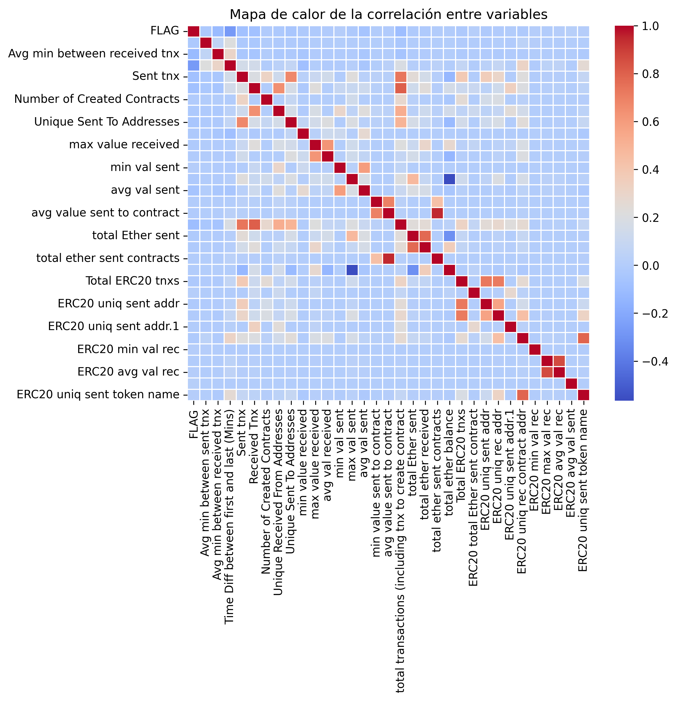
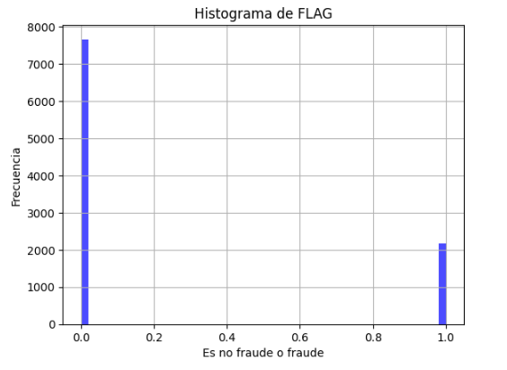
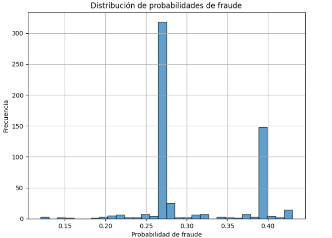
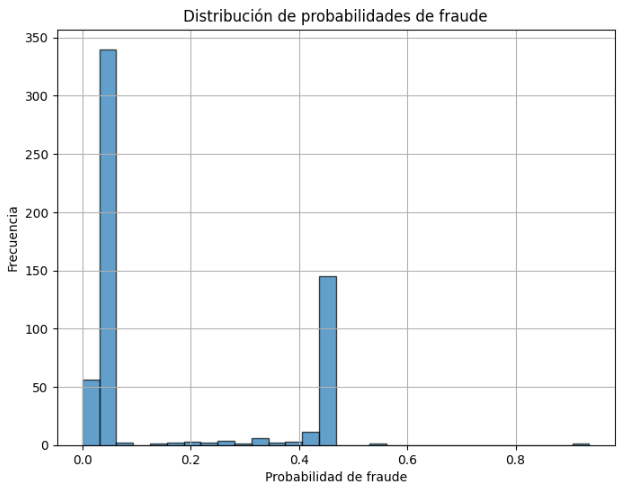
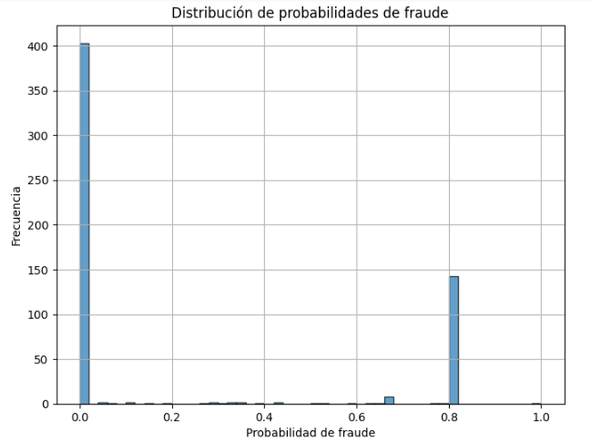
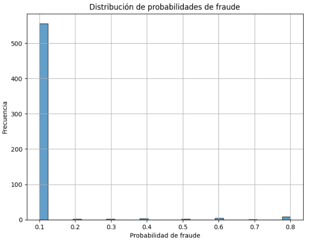
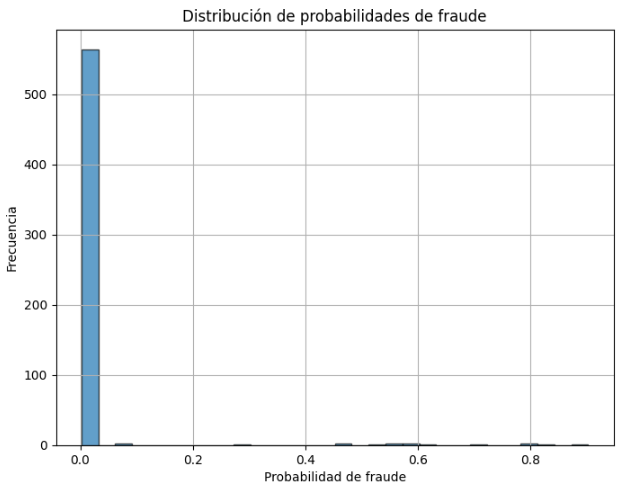

# 🧾 Resumen

El proyecto comenzó con el análisis de un conjunto de datos de transacciones en Ethereum, el cual presentaba un fuerte desbalance entre transacciones legítimas y fraudulentas. Se llevó a cabo un análisis exploratorio de datos (EDA) y una limpieza del dataset, evaluando diferentes estrategias de balanceo como SMOTE. A partir de esta base, se entrenaron y compararon una serie de modelos: una red neuronal implementada desde cero, una red utilizando la librería Keras, un modelo clásico de Random Forest, un modelo de regresión logística y un modelo XGBoost. Según las métricas de evaluación (precisión, recall, F1-score), Random Forest y XGBoost resultaron ser los modelos más efectivos, alcanzando una alta capacidad de detección. Una vez validado los modelos, se desarrolló un pipeline para obtener datos en tiempo real desde la API de Alchemy y clasificar nuevas transacciones automáticamente. Todo el desarrollo fue subido a un repositorio público en GitHub, y como cierre del proyecto se implementó una aplicación web utilizando Streamlit. En esta app, los usuarios pueden ingresar un hash de transacción y seleccionar el modelo con el que desean clasificarla. De este modo, se integran todos los componentes del proyecto —desde el análisis de datos hasta la interfaz de usuario— en una solución funcional y accesible.


# 🧾Introducción

En el contexto actual del crecimiento exponencial de las criptomonedas, Ethereum se ha consolidado como una de las plataformas blockchain más utilizadas a nivel global. Sin embargo, junto con su popularidad también han aumentado las actividades fraudulentas en su red, como transacciones falsas, esquemas de phishing y otros tipos de estafas. Detectar este tipo de comportamiento en tiempo real es fundamental para proteger a los usuarios y mantener la integridad del ecosistema.

### 🎯 Objetivo general

Desarrollar un sistema capaz de detectar automáticamente transacciones fraudulentas en la red de Ethereum utilizando técnicas de aprendizaje automático y aprendizaje profundo.

✅ **Objetivos específicos**

- Analizar y procesar un conjunto de datos reales de transacciones en Ethereum.
- Aplicar un análisis exploratorio de datos (EDA) que permita comprender el comportamiento del conjunto y realizar una limpieza adecuada.
- Explorar y comparar distintos modelos de clasificación, incluyendo redes neuronales, modelos construidos desde cero y modelos clásicos como Random Forest o Regresión logística.
- Evaluar el desempeño de los modelos mediante métricas estándar (accuracy, precision, recall, F1-score).
- Seleccionar el o los modelos con mejor rendimiento, aplicando sobre él o ellos una validación interna y un proceso de optimización de hiperparámetros.
- Obtener datos en tiempo real desde la API de Alchemy y preprocesarlos para que tengan la misma estructura y atributos que el dataset de entrenamiento.
- Aplicar el o los modelos entrenados, validados y optimizados a los datos externos para clasificar nuevas transacciones como fraudulentas o legítimas.
- Subir todos los modelos, scripts de procesamiento, EDA, consultas a la API a un repositorio público de GitHub para su disponibilidad y reutilización.
- Desarrollar una aplicación web interactiva mediante Streamlit, donde los usuarios puedan consultar cualquier transacción en la red y seleccionar el modelo con el que desean hacer la predicción (aunque se recomienda el uso del modelo Random Forest por su mayor desempeño).

🧠 **Justificación del uso de redes neuronales**

El uso de redes neuronales se justifica por su capacidad para modelar patrones complejos y no lineales en grandes volúmenes de datos, como ocurre en las transacciones blockchain. A diferencia de los modelos clásicos, las redes neuronales pueden captar relaciones sutiles entre múltiples variables que pueden pasar desapercibidas en otros enfoques. Este tipo de modelos ha demostrado un desempeño superior en tareas de detección de anomalías y clasificación de eventos raros, como el fraude en redes descentralizadas. Por esta razón, el trabajo no solo implementa modelos tradicionales, sino que también explora el potencial de redes neuronales desarrolladas desde cero y a través de frameworks como Keras.


# 📊 Exploración y análisis de datos (EDA)

## 📌 Descripción general del dataset

Cada fila representa una **cuenta única de Ethereum**, con estadísticas agregadas sobre su comportamiento en transacciones y uso de tokens.

El dataset original cuenta con **51 columnas**, incluyendo la variable objetivo `FLAG`, que indica si una cuenta está asociada a actividad fraudulenta (`1`) o no (`0`). El dataset está **desbalanceado**, con una menor proporción de cuentas fraudulentas.

## 🧷 Significado de las columnas

| **Nombre de columna** | **Descripción** |
| --- | --- |
| `Address` | Dirección de la cuenta de Ethereum. |
| `FLAG` | Indica si la cuenta es fraudulenta (1) o no (0). |
| `Avg min between sent tnx` | Tiempo promedio entre transacciones enviadas (en minutos). |
| `Avg_min_between_received_tnx` | Tiempo promedio entre transacciones recibidas (en minutos). |
| `Time_Diff_between_first_and_last(Mins)` | Tiempo total entre la primera y última transacción (en minutos). |
| `Sent_tnx` | Total de transacciones normales enviadas. |
| `Received_tnx` | Total de transacciones normales recibidas. |
| `Number_of_Created_Contracts` | Total de contratos creados por la cuenta. |
| `Unique_Received_From_Addresses` | Número de direcciones únicas desde las que se recibió Ether. |
| `Unique_Sent_To_Addresses20` | Número de direcciones únicas a las que se envió Ether. |
| `Min_Value_Received` | Valor mínimo de Ether recibido. |
| `Max_Value_Received` | Valor máximo de Ether recibido. |
| `Avg_Value_Received` | Valor promedio de Ether recibido. |
| `Min_Val_Sent` | Valor mínimo de Ether enviado. |
| `Max_Val_Sent` | Valor máximo de Ether enviado. |
| `Avg_Val_Sent` | Valor promedio de Ether enviado. |
| `Min_Value_Sent_To_Contract` | Valor mínimo enviado a contratos. |
| `Max_Value_Sent_To_Contract` | Valor máximo enviado a contratos. |
| `Avg_Value_Sent_To_Contract` | Valor promedio enviado a contratos. |
| `Total_Transactions(Including_Tnx_to_Create_Contract)` | Total de transacciones, incluidas las de creación de contratos. |
| `Total_Ether_Sent` | Total de Ether enviado. |
| `Total_Ether_Received` | Total de Ether recibido. |
| `Total_Ether_Sent_Contracts` | Total de Ether enviado a contratos. |
| `Total_Ether_Balance` | Saldo final de Ether. |
| `Total_ERC20_Tnxs` | Total de transacciones de tokens ERC20. |
| `ERC20_Total_Ether_Received` | Total recibido en transacciones de tokens ERC20. |
| `ERC20_Total_Ether_Sent` | Total enviado en transacciones de tokens ERC20. |
| `ERC20_Total_Ether_Sent_Contract` | Total enviado a contratos en tokens ERC20. |
| `ERC20_Uniq_Sent_Addr` | Total de direcciones únicas a las que se enviaron tokens ERC20. |
| `ERC20_Uniq_Rec_Addr` | Total de direcciones únicas desde las que se recibieron tokens ERC20. |
| `ERC20_Uniq_Rec_Contract_Addr` | Total de contratos únicos desde los que se recibieron tokens ERC20. |
| `ERC20_Avg_Time_Between_Sent_Tnx` | Tiempo promedio entre envíos de tokens ERC20. |
| `ERC20_Avg_Time_Between_Rec_Tnx` | Tiempo promedio entre recepciones de tokens ERC20. |
| `ERC20_Avg_Time_Between_Contract_Tnx` | Tiempo promedio entre transacciones hacia contratos en tokens ERC20. |
| `ERC20_Min_Val_Rec` | Valor mínimo recibido en transacciones ERC20. |
| `ERC20_Max_Val_Rec` | Valor máximo recibido en transacciones ERC20. |
| `ERC20_Avg_Val_Rec` | Valor promedio recibido en transacciones ERC20. |
| `ERC20_Min_Val_Sent` | Valor mínimo enviado en transacciones ERC20. |
| `ERC20_Max_Val_Sent` | Valor máximo enviado en transacciones ERC20. |
| `ERC20_Avg_Val_Sent` | Valor promedio enviado en transacciones ERC20. |
| `ERC20_Uniq_Sent_Token_Name` | Número de tipos únicos de tokens enviados. |
| `ERC20_Uniq_Rec_Token_Name` | Número de tipos únicos de tokens recibidos. |
| `ERC20_Most_Sent_Token_Type` | Tipo de token más enviado. |
| `ERC20_Most_Rec_Token_Type` | Tipo de token más recibido. |

## 🧪 Análisis exploratorio inicial

### 🔹 Inspección general: `.info()`

Se identificó que muchas columnas, especialmente de la 26 en adelante (relacionadas con tokens ERC20), contienen **valores nulos**.

- Las últimas columnas, como `ERC20_Most_Sent_Token_Type` y `ERC20_Most_Rec_Token_Type`, son categóricas con **alto porcentaje de nulos** y fueron eliminadas del análisis.
- Los **valores nulos en variables numéricas** se imputaron con la media.

### 🔁 Correlación cruzada entre `FLAG` y el resto de las variables

Se llevó a cabo una **correlación cruzada entre la variable `FLAG`** (indicador de fraude) y todas las demás columnas del dataset. El objetivo era determinar qué tan relacionadas están las características disponibles con la etiqueta de clasificación.

### 📊 Resultado:

- Todas las correlaciones cruzadas obtenidas entre `FLAG` y las demás variables arrojaron **valores absolutos menores a 0.1**.
- Esto indica una **muy baja relación lineal directa o inversa** con la variable objetivo.

### 📌 Implicancias:

- La ausencia de una correlación fuerte sugiere que **no hay atributos individuales que por sí solos expliquen el fraude de manera lineal**.
- Este hallazgo **no implica que las variables sean inútiles**, sino que **las relaciones relevantes pueden ser no lineales o depender de interacciones complejas**.

## 🧹 Limpieza y reducción del dataset

### 🔸 Columnas con valores constantes (solo ceros)

Se eliminaron 7 columnas que contenían exclusivamente valores 0:

- `ERC20 avg time between sent tnx`
- `ERC20 avg time between rec tnx`
- `ERC20 avg time between rec 2 tnx`
- `ERC20 avg time between contract tnx`
- `ERC20 min val sent contract`
- `ERC20 max val sent contract`
- `ERC20 avg val sent contract`

Estas columnas **no aportan varianza ni información útil al modelo**.

### 🔸 Columnas irrelevantes

Se eliminaron además:

- `Unnamed: 0`
- `Index`

por ser simplemente índices sin valor predictivo.

### 🔸 Eliminación de columnas altamente correlacionadas

Se construyó una matriz de correlación y se eliminaron los siguientes pares redundantes (corr ≥ 0.99):

| Par de columnas altamente correlacionadas | Columna eliminada |
| --- | --- |
| `max val sent to contract` — `total ether sent contracts` | `max val sent to contract` |
| `ERC20 total Ether received` — `ERC20 max val rec` | `ERC20 total Ether received` |
| `ERC20 max val sent` — `ERC20 avg val sent` | `ERC20 max val sent` |
| `ERC20 min val sent` — `ERC20 avg val sent` | `ERC20 min val sent` |
| `ERC20 total ether sent` — `ERC20 max val sent` | `ERC20 total ether sent` |
| `ERC20 uniq rec contract addr` — `ERC20 uniq rec token name` | `ERC20 uniq rec token name` |
| `ERC20 total ether sent` — `ERC20 avg val sent` | — (ya eliminada arriba) |

Estas columnas fueron eliminadas para reducir la **multicolinealidad** y simplificar el modelo.




## 📊 Análisis de balance y visualización

### Conteo de la variable `FLAG`:

✅ **Resultados:**

- **Cuentas legítimas (0):** 7662 (≈77.86%)
- **Cuentas fraudulentas (1):** 2179 (≈22.14%)



Se confirma un **fuerte desbalance** de clases. Esto será considerado durante el modelado (ponderación, muestreo o métricas apropiadas).

## 📁 Resultado final

Tras el preprocesamiento:

- Se pasó de **51 a 33 columnas**.
- Se conservaron únicamente **columnas numéricas relevantes**.
- El dataset quedó listo para aplicar modelos de clasificación, con menor redundancia y mayor calidad.

### ✅ Recomendaciones:

- Utilizar modelos capaces de capturar relaciones **no lineales y multidimensionales**, como:
    - Random Forest, Gradient Boosting, XGBoost.
    - Redes neuronales (MLP).


# Modelos:

## 🧠 Modelo de Red Neuronal

### 🎯 Objetivo

Este modelo de red neuronal fue desarrollado para detectar fraudes en transacciones financieras. El modelo fue entrenado utilizando un conjunto de datos desbalanceado (`transaction_dataset_clean.csv`), y se implementaron técnicas de preprocesamiento, normalización y ajuste de hiperparámetros. Se evaluaron dos enfoques: sin oversampling y con oversampling (SMOTE) para la mejora del rendimiento en la clase minoritaria (fraude).

 

### 📦 Librerías utilizadas

```python
import numpy as np
import pandas as pd
import matplotlib.pyplot as plt
import seaborn as sns
from sklearn.model_selection import train_test_split
from sklearn.preprocessing import StandardScaler
from sklearn.metrics import confusion_matrix, classification_report
from imblearn.over_sampling import SMOTE
```

### 🧾 **Características del Modelo:**

- **Arquitectura de la Red Neuronal:**
    - Entrada: 32 neuronas
    - Ocultas: 20 neuronas
    - Salida: 2 neuronas
- **Activaciones:**
    - 'sigmoid' y 'tanh'
- **Método de Entrenamiento:**
    - **Algoritmo:** Backpropagation con descenso del gradiente
    - **Aprendizaje Estocástico**
    - **Criterio de Parada:** Convergencia del error
- **Métricas Evaluadas:**
    - Precisión
    - Recall
    - F1-Score
    - Accuracy
    - Matriz de confusión

### ⚙️ Preprocesamiento

- División en conjunto de entrenamiento y test (70/30).
- **Normalización** por media y desvío estándar usando `StandardScaler`.
- **One-hot encoding** aplicado a la variable objetivo.
- Codificación de la salida en el rango `[-1, 1]` para adaptarse a `tanh`.

> Se probó también usar SMOTE para balancear las clases en el entrenamiento.
> 

---

### 📊 **Resultados Sin Oversampling:**

### **Matriz de Confusión (Test) y Métricas:**

```

[[2243   60]
 [  66  584]]

```

| Clase | Precision | Recall | F1-Score | Support |
| --- | --- | --- | --- | --- |
| **0** | 0.97 | 0.97 | 0.97 | 2303 |
| **1** | 0.91 | 0.90 | 0.90 | 650 |
| **Accuracy** |  |  | **0.96** | 2953 |
| **Macro Avg** | 0.94 | 0.94 | 0.94 | 2953 |
| **Weighted Avg** | 0.96 | 0.96 | 0.96 | 2953 |

### **Análisis:**

- **Generalización:** La pequeña diferencia entre accuracy de entrenamiento (96.6%) y prueba (95.7%) sugiere que el modelo no está sobreajustado ni subajustado.
- **Desempeño en la clase 0 (no fraude):** Muy buen desempeño en esta clase debido a la mayor cantidad de ejemplos.
- **Desempeño en la clase 1 (fraude):** Aunque el recall es de 90%, hay margen para mejorar en la detección de fraudes (falsos negativos).

---

### 📊 **Resultados con Oversampling (SMOTE):**

### **Métricas Clave:**

- **Accuracy:** Entre 45% y 60% (bajo rendimiento).
- **Clase 1 (fraude):**
    - **Recall:** 0.99 (el modelo detecta casi todos los fraudes).
    - **Precision:** Muy baja, debido a un alto número de falsos positivos.
- **Métricas Generales:**
    - **Precision, Recall y F1-Score:** En orden similar al accuracy, con una disminución general del desempeño.

### **Análisis:**

- **Desempeño del Oversampling:** El modelo con SMOTE presenta un alto recall para la clase 1, pero este se logra a costa de muchos falsos positivos, lo que disminuye significativamente la precisión y el accuracy global.
- **Posible Causa:** El uso de SMOTE podría haber introducido datos sintéticos que no representan bien la distribución real de la clase minoritaria (fraude), lo que afecta la generalización del modelo.

---

### 🟢 **Conclusiones:**

- **Modelo Sin Oversampling:**
    - El modelo tiene un excelente desempeño, con un buen balance entre precisión y recall, especialmente para la clase 0 (no fraude). El modelo detecta el 90% de los fraudes, lo que es un desempeño sólido.
- **Modelo con Oversampling:**
    - El modelo con oversampling presenta un buen recall en la clase 1 (fraude), pero el modelo genera demasiados falsos positivos, afectando gravemente la precisión y el accuracy general.

### 📌 Conclusión final

- El modelo sin oversampling es más robusto y tiene un mejor rendimiento general, con un pequeño ajuste en el recall de la clase 1 se podría mejorar la detección de fraudes. El modelo con oversampling no se recomienda usarlo (al menos no en este tipo de problemas), ya que distorsiona la realidad, es decir, es natural que haya más no fraudes que fraudes, por lo que al generar datos sintéticos se estaría “contaminando” el dataset.


## 🤖 Modelo de Red Neuronal con Keras

### 🎯 Objetivo

Probar un modelo de red neuronal usando Keras sobre el dataset limpio (`transaction_dataset_clean.csv`) y comparar sus resultados con el modelo desarrollado a mano anteriormente.

---

### 📦 Librerías utilizadas

```python

import numpy as np
import pandas as pd
from tensorflow.keras.models import Sequential
from tensorflow.keras.layers import Dense
from tensorflow.keras.utils import to_categorical
from sklearn.model_selection import train_test_split
from sklearn import metrics
from sklearn.preprocessing import StandardScaler
from imblearn.over_sampling import SMOTE
import matplotlib.pyplot as plt

```

---

### 🧾 Estructura del modelo

- **Entradas:** 32 atributos (features)
- **Capa oculta:** 1 capa con 20 neuronas, activación `sigmoid`
- **Capa de salida:** 2 neuronas, activación `tanh`
- **Optimización:** `SGD`
- **Función de pérdida:** `mean_squared_error`
- **Métricas:** Accuracy, Precision, Recall, F1-score

---

### ⚙️ Preprocesamiento

- División en conjunto de entrenamiento y test (70/30).
- **Normalización** por media y desvío estándar usando `StandardScaler`.
- **One-hot encoding** aplicado a la variable objetivo.
- Codificación de la salida en el rango `[-1, 1]` para adaptarse a `tanh`.

> Se probó también usar SMOTE para balancear las clases en el entrenamiento.
> 

---

### 📊 Resultados sin SMOTE

**Matriz de confusión (Test):**

```

[[2277   26]
 [ 363  287]]

```

**Reporte de clasificación:**

| Clase | Precision | Recall | F1-score | Soporte |
| --- | --- | --- | --- | --- |
| 0 | 0.86 | 0.99 | 0.92 | 2303 |
| 1 | 0.91 | 0.44 | 0.59 | 650 |
- **Accuracy:** 0.87
- **Macro avg F1:** 0.76
- **Weighted avg F1:** 0.85

🔴 **Conclusión sin SMOTE:**

El modelo no logra buenos resultados para la clase 1 (fraude). Predice bien la clase mayoritaria, pero falla mucho en la minoritaria: más de la mitad de los fraudes no se detectan. Aunque el accuracy es razonable, no refleja el verdadero desempeño debido al desbalance de clases.

---

### 📊 Resultados con SMOTE

**Matriz de confusión (Test):**

```
lua
CopiarEditar
[[1891  412]
 [  76  574]]

```

**Reporte de clasificación:**

| Clase | Precision | Recall | F1-score | Soporte |
| --- | --- | --- | --- | --- |
| 0 | 0.96 | 0.82 | 0.89 | 2303 |
| 1 | 0.58 | 0.88 | 0.70 | 650 |
- **Accuracy:** 0.83
- **Macro avg F1:** 0.79
- **Weighted avg F1:** 0.85

🟢 **Conclusión con SMOTE:**

El modelo mejora sustancialmente en la detección de fraudes. El recall y el F1-score de la clase 1 aumentan considerablemente, lo cual es clave en este tipo de problemas. Aunque el accuracy general baja, el modelo es más justo y útil para el propósito del análisis.

---

### 📌 Conclusiones generales

- Se probó una arquitectura muy similar a la red neuronal desarrollada a mano.
- Los resultados sin técnicas de balanceo no fueron buenos para la clase 1.
- SMOTE mejoró considerablemente la detección de fraudes, sin embargo, hay que tener en cuenta que al generar datos sintéticos no se está reflejando la realidad del problema, es decir, es natural que haya menos fraudes que no fraudes. Por lo que con técnicas de oversampling se estaría “contaminando” el dataset, además los resultados tampoco fueron muy buenos en comparación con el modelo de red neuronal desarrollado anteriormente.


## 🌲 Modelo Random Forest

### 🎯 Objetivo

Probar un modelo clásico de machine learning usando Random Forest sobre el dataset limpio (`transaction_dataset_clean.csv`) y comparar sus resultados con los modelos desarrollados anteriormente.

### 📦 Librerías utilizadas

```python
import numpy as np
import pandas as pd
from sklearn.ensemble import RandomForestClassifier                                      
from sklearn.metrics import classification_report, confusion_matrix, roc_curve, auc      
from sklearn.model_selection import train_test_split, RandomizedSearchCV             
import matplotlib.pyplot as plt

```

### 🧪 Desarrollo del modelo

### 1. **Preparación de los datos**

- Se utilizó el dataset limpio con el que se venía trabajando.
- Se separó la variable objetivo `'FLAG'` del resto de los predictores.
- Se aplicó una división **estratificada** del dataset:
    - 70% para entrenamiento
    - 15% para validación
    - 15% para test

```python

X_train, X_temp, y_train, y_temp = train_test_split(X, y, test_size=0.3, stratify=y, random_state=42)
X_val, X_test, y_val, y_test = train_test_split(X_temp, y_temp, test_size=0.5, stratify=y_temp, random_state=42)

```

### 2. **Normalización**

- Se normalizaron los datos con `StandardScaler`, ajustando solo sobre el conjunto de entrenamiento y transformando el resto.

```python

scaler = StandardScaler()
scaler.fit(X_train)
X_train = scaler.transform(X_train)
X_val = scaler.transform(X_val)
X_test = scaler.transform(X_test)

```

### 3. **Entrenamiento inicial**

- Se entrenó un primer modelo base de `RandomForestClassifier` con 100 árboles para evaluar desempeño preliminar.
- Métricas mostraron un rendimiento alto desde el inicio.

### 4. **Optimización de hiperparámetros**

- Se utilizó `RandomizedSearchCV` para encontrar la mejor combinación de hiperparámetros con `class_weight='balanced'`.
- Se usó validación cruzada con 5 folds sobre el conjunto de **validación**, no sobre el de entrenamiento, para evitar sobreajuste.

```python

random_search = RandomizedSearchCV(
    estimator=RandomForestClassifier(class_weight='balanced', random_state=42, n_jobs=-1),
    param_distributions=param_grid,
    n_iter=20,
    cv=5,
    verbose=2,
    random_state=42,
    n_jobs=-1
)
random_search.fit(X_val, y_val)
```

### 5. **Evaluación del modelo optimizado**

- Se reentrenó el modelo con los **mejores hiperparámetros** encontrados sobre el conjunto de entrenamiento.
- Se evaluó el desempeño en el conjunto de test.

```python

rf_opt = RandomForestClassifier(**mejores_params, class_weight='balanced', random_state=42, n_jobs=-1)
rf_opt.fit(X_train, y_train)
y_test_pred = rf_opt.predict(X_test)

```

---

### 📈 Resultados en conjunto de test

**Matriz de confusión:**

```

[[1146    4]
 [  21  306]]

```

**Reporte de clasificación:**

| Clase | Precision | Recall | F1-Score | Soporte |
| --- | --- | --- | --- | --- |
| 0 (no fraude) | 0.98 | 1.00 | 0.99 | 1150 |
| 1 (fraude) | 0.99 | 0.94 | 0.96 | 327 |
| **Accuracy global** |  |  | **0.98** | 1477 |

---

### 📌 Análisis y Justificación

### ¿El modelo puede mejorar más?

El modelo alcanza un desempeño excelente, sobre todo en la clase minoritaria (fraude):

- **Precisión: 0.99** → casi ningún falso positivo.
- **Recall: 0.94** → detecta 94% de los fraudes.
- **F1-score: 0.96** → excelente equilibrio entre precisión y recall.

### ¿Aplicar SMOTE?

Se decidió **no aplicar técnicas como SMOTE**, por los siguientes motivos:

- El modelo ya detecta fraudes con alto rendimiento.
- Generar fraudes sintéticos **distorsionaría la distribución real del problema**, que es naturalmente desbalanceada.
- Es preferible que el modelo aprenda en el contexto realista, donde el fraude ocurre 1 de cada 5 veces o menos.

### ¿Bajar el umbral de decisión?

También se decidió **no modificar el umbral predeterminado (0.5)**:

- Bajar el umbral podría aumentar el recall, pero **a costa de muchos más falsos positivos**, lo que no es aceptable en este contexto.
- Dado el balance actual entre precisión y recall, **el valor por defecto del umbral es razonable**.
- Incluso se consideró que **subir** el umbral podría tener más sentido si se buscara aún más certeza ante una predicción de fraude.

---

### 📎 Conclusión

El modelo ha sido optimizado correctamente, alcanzando métricas sobresalientes en un problema desbalanceado. Se considera que **ya llegó a su límite razonable de mejora**, y se justifica **no aplicar técnicas adicionales como SMOTE ni modificar el umbral de clasificación**.

El modelo es robusto, eficiente y confiable para detectar fraudes con alta precisión sin comprometer la tasa de falsos positivos.

## 📈 Modelo Regresión Logística

### 📋 Objetivo

El objetivo de este modelo fue detectar transacciones fraudulentas utilizando un enfoque supervisado de clasificación binaria mediante regresión logística. Se aplicaron distintas estrategias para abordar el problema del desbalance de clases.

---

### 🧪 Dataset

- Se utilizó un dataset de transacciones (`transaction_dataset_clean.csv`) donde la variable objetivo es `FLAG` (0: Sin fraude, 1: Con fraude).
- Se aplicaron transformaciones con `get_dummies()` para convertir variables categóricas en variables numéricas.
- División de los datos:
    - Entrenamiento: 30%
    - Test: 70%

---

### ⚙️ Modelo base (sin balanceo)

- **Clasificador**: `LogisticRegression` (penalización L2, solver: newton-cg)
- **Métrica principal**: F1-score, especialmente para la clase minoritaria (fraude)

### Resultados:

| Clase | Precisión | Recall | F1-score |
| --- | --- | --- | --- |
| Sin fraude | 0.85 | 1.00 | 0.92 |
| Con fraude | 0.99 | 0.37 | 0.54 |
| **Accuracy** | **0.86** |  |  |

🔎 **Observación**: Alta precisión pero baja recuperación de fraudes (recall 0.37), típico en datasets desbalanceados.

---

### ⚖️ Estrategias de Balanceo

### 📍 1. Penalización (`class_weight="balanced"`)

- Ajuste automático de pesos inversamente proporcionales a la frecuencia de las clases.

**Resultados:**

| Clase | Precisión | Recall | F1-score |
| --- | --- | --- | --- |
| Sin fraude | 0.88 | 0.98 | 0.93 |
| Con fraude | 0.90 | 0.53 | 0.67 |
| **Accuracy** | **0.88** |  |  |

✅ **Mejora significativa del recall en la clase minoritaria.**

---

### 📍 2. Under-Sampling (NearMiss)

- Reducción de la clase mayoritaria para igualar la cantidad de muestras.

**Resultados:**

| Clase | Precisión | Recall | F1-score |
| --- | --- | --- | --- |
| Sin fraude | 0.98 | 0.36 | 0.53 |
| Con fraude | 0.30 | 0.97 | 0.46 |
| **Accuracy** | **0.50** |  |  |

⚠️ **Muy bajo rendimiento general. Aunque mejora el recall de fraudes, baja mucho la precisión.**

---

### 📍 3. Over-Sampling (RandomOverSampler)

- Réplica de muestras de la clase minoritaria.

**Resultados:**

| Clase | Precisión | Recall | F1-score |
| --- | --- | --- | --- |
| Sin fraude | 0.88 | 0.98 | 0.93 |
| Con fraude | 0.87 | 0.54 | 0.67 |
| **Accuracy** | **0.88** |  |  |

✅ **Resultados similares al caso de penalización. Mejora sin afectar negativamente el modelo.**

---

### 📍 4. Ensamble Balanceado (BalancedBaggingClassifier)

- Uso de múltiples modelos con muestreo balanceado interno.

**Resultados:**

| Clase | Precisión | Recall | F1-score |
| --- | --- | --- | --- |
| Sin fraude | 0.98 | 0.97 | 0.98 |
| Con fraude | 0.91 | 0.94 | 0.92 |
| **Accuracy** | **0.97** |  |  |

🏆 **Mejor estrategia de todas**: Altísima precisión y recall para ambas clases.

---

### 📈 Conclusión

- El modelo de regresión logística sin balancear **no es suficiente** para detectar fraudes de forma efectiva.
- Las estrategias de **penalización** y **oversampling** logran mejoras considerables.
- La mejor performance se logró con **BalancedBaggingClassifier**, obteniendo un excelente balance entre precisión y recall.
- El tratamiento del desbalance de clases es **crucial** para problemas de detección de fraude.

## ⚡ Modelo XGBoost

### 📌 Objetivo

El script entrena y evalúa un modelo de clasificación con distintos enfoques de balanceo de clases para detectar transacciones fraudulentas en un dataset desbalanceado.

---

### 🧩 Dependencias

- `pandas`, `numpy`
- `matplotlib`, `seaborn`
- `sklearn`: métricas, split de datos
- `xgboost`
- `imblearn`: técnicas de resampling y ensemble

---

### 🧶 Estructura del Script

### 1. **Carga de Datos**

Se carga un archivo CSV con datos de transacciones. Se imprime la dimensión del dataset y la distribución de clases (`FLAG`: 0 = no fraude, 1 = fraude).

```python

df = pd.read_csv("../../datasets/transaction_dataset.csv")
```

### 2.**Preprocesamiento**

- Se eliminan columnas irrelevantes (`Unnamed: 0`, `Index`).
- Se filtran sólo columnas numéricas.
- Se imputan valores faltantes con la media.
- Se separan las variables predictoras (`X`) de la variable objetivo (`y`).
- Se divide el dataset en entrenamiento y prueba (70% test, estratificado).

---

### 3. **Definición de Funciones**

- `run_xgb_model(...)`: entrena un modelo `XGBClassifier`, con opción de ajustar el parámetro `scale_pos_weight` para desbalanceo.
- `show_results(...)`: genera la matriz de confusión y métricas de evaluación (`precision`, `recall`, `f1-score`).

---

### ⚙️ Estrategias de Balanceo Probadas

Cada bloque entrena un modelo XGBoost con una estrategia distinta de balanceo. Se evalúan con el mismo conjunto de prueba.

| Estrategia | Descripción |
| --- | --- |
| 🔹 Sin balanceo | Modelo base, sin ajuste por desbalanceo. |
| 🔹 `scale_pos_weight` | Ajuste de peso para la clase minoritaria (fraude). |
| 🔹 Under-sampling | Usa `NearMiss()` para reducir la clase mayoritaria. |
| 🔹 Over-sampling | Usa `RandomOverSampler()` para duplicar muestras de la clase minoritaria. |
| 🔹 SMOTE-Tomek | Combinación de oversampling (SMOTE) y limpieza (Tomek links). |
| 🔹 Ensemble balanceado | Usa `BalancedBaggingClassifier` con `XGBClassifier` como modelo base. |

---

### 📊 Resultados

Cada modelo genera:

- Matriz de confusión
- Métricas de clasificación (`precision`, `recall`, `f1-score`) por clase

### 📊 Comparación de Resultados - Modelo XGBoost

| Método | Clase | Precision | Recall | F1-score | Accuracy |
| --- | --- | --- | --- | --- | --- |
| **1. Sin Balanceo** | Sin fraude | 0.98 | 0.99 | 0.99 |  |
|  | Con fraude | 0.98 | 0.93 | 0.95 | **0.98** |
|  | **Macro Avg** | **0.98** | 0.96 | 0.97 |  |
|  | **Weighted** | **0.98** | 0.98 | 0.98 |  |
| **2. Scale Pos Weight** | Sin fraude | 0.98 | 0.99 | 0.99 |  |
|  | Con fraude | 0.97 | 0.95 | 0.96 | **0.98** |
|  | **Macro Avg** | **0.98** | 0.97 | 0.97 |  |
|  | **Weighted** | **0.98** | 0.98 | 0.98 |  |
| **3. Under-sampling** | Sin fraude | 1.00 | 0.58 | 0.73 |  |
|  | Con fraude | 0.40 | 1.00 | 0.57 | **0.67** |
|  | **Macro Avg** | **0.70** | 0.79 | 0.65 |  |
|  | **Weighted** | **0.87** | 0.67 | 0.70 |  |
| **4. Over-sampling** | Sin fraude | 0.98 | 0.99 | 0.99 |  |
|  | Con fraude | 0.97 | 0.94 | 0.95 | **0.98** |
|  | **Macro Avg** | **0.98** | 0.97 | 0.97 |  |
|  | **Weighted** | **0.98** | 0.98 | 0.98 |  |
| **5. Ensemble Balanceado** | Sin fraude | 0.99 | 0.98 | 0.98 |  |
|  | Con fraude | 0.94 | 0.96 | 0.95 | **0.98** |
|  | **Macro Avg** | **0.96** | 0.97 | 0.97 |  |
|  | **Weighted** | **0.98** | 0.98 | 0.98 |  |

---

### 📝 Observaciones clave:

- **Sin balanceo**, el modelo ya tenía un rendimiento muy alto, pero con **falsos negativos** más marcados (recall más bajo para fraudes).
- **`scale_pos_weight` y `Over-sampling`** mejoran el recall para la clase minoritaria (`Con fraude`), manteniendo la precisión general.
- **Under-sampling** causa una gran pérdida de precisión para la clase minoritaria, aunque logra alto recall (predice todos los fraudes, pero con muchos falsos positivos).
- **Balanced Bagging Ensemble** ofrece un muy buen equilibrio entre clases, con **mejor precision-recall para fraudes** sin sacrificar demasiado la clase mayoritaria.

### 🧠 Conclusión final:

> El método de Balanced Bagging Ensemble es el más robusto y efectivo para el modelo XGBoost, ya que logra un balance óptimo entre precisión y recall para ambas clases, lo cual es esencial en tareas sensibles como la detección de fraude. Ofrece alta capacidad de detección sin comprometer la fiabilidad general del sistema.


# 🧠 Comparación de modelos

🧾 A lo largo del proyecto se evaluaron varios enfoques distintos para la detección de fraudes: un modelo de regresión logística, una red neuronal implementada manualmente, una red neuronal utilizando Keras, un modelo clásico de Machine Learning basado en Random Forest y un modelo XGBoost. Cada uno de estos modelos fue probado tanto con como sin técnicas de balanceo como oversampling (excepto el modelo de Random Forest), undersampling, etc y se analizaron sus resultados de manera integral.

🧠 Regresión logística s**in balanceo**

Alta precisión para la clase *sin fraude* (0.98), pero muy bajo recall para *fraude* (0.17). Tiene alta exactitud general (0.89), pero prácticamente no detecta fraudes. Inadecuado para contextos donde el recall en la clase minoritaria es clave.

🧠 Regresión logística con **`class_weight='balanced'`**

Mejora el recall de *fraude* (0.71), pero con baja precisión (0.29), lo que genera muchos falsos positivos. Aumenta la sensibilidad al fraude, sacrificando exactitud global (0.73). Útil cuando se prioriza no perder fraudes. 

🧠 Regresión logística con **Under-sampling (NearMiss)**

Muy alto recall en *fraude* (0.99), pero muy baja precisión (0.29), afectando fuertemente la exactitud (0.67). Aumenta sensibilidad, pero a costa de generar muchos errores de clasificación. Solo recomendable si detectar fraudes a toda costa es la prioridad.

🧠 Regresión logística con **Over-sampling (RandomOverSampler)** 

Buen balance entre precisión y recall: 0.94 y 0.73 para *fraude* respectivamente. Accuracy global aceptable (0.92). Riesgo leve de overfitting, pero rendimiento general estable.

🧠 Regresión logística con **Balanced Bagging**

F1-score alto en *fraude* (0.85) con buen balance entre precisión (0.86) y recall (0.83). Accuracy alta (0.95), sin comprometer la detección de fraudes. Mejor opción global: logra equilibrio sin modificar la distribución de test. Siendo esta variante la mejor opción para este modelo, arrojando las mejores métricas.

🧠 **XGBoost sin balanceo**

Muy alta precisión (0.98) y accuracy (0.98), pero recall para *fraude* algo limitado (0.93). F1-score en fraude de 0.95. Rinde muy bien, pero tiende a favorecer la clase mayoritaria.

🧠 **XGBoost con `scale_pos_weight`** 

Mejora el recall en *fraude* a 0.95 manteniendo precisión alta (0.97). F1-score en *fraude* de 0.96, accuracy total de 0.98. Excelente opción para ajustar desequilibrio leve-moderado sin alterar los datos. 

🧠 **XGBoost con Under-sampling (NearMiss)**

Recall perfecto en *fraude* (1.00), pero precisión muy baja (0.40) y accuracy general baja (0.67). F1-score de 0.57 en fraude. Útil en casos donde no se puede permitir pasar un fraude, pero muy ineficiente globalmente.

🧠 **XGBoost con Over-sampling (RandomOverSampler)** 

Alto rendimiento: precisión de 0.97 y recall de 0.94 en *fraude*, F1-score de 0.95. Accuracy estable en 0.98. Buena opción con bajo riesgo de overfitting en este caso.

🧠 **XGBoost con Balanced Bagging** 

Gran equilibrio: precisión (0.94), recall (0.96), F1-score (0.95) en *fraude*. Accuracy total muy alta (0.98). Mejor alternativa general, detecta fraudes sin afectar negativamente el rendimiento global. Siendo esta variante la mejor opción para este modelo, arrojando las mejores métricas.

🧠 **Red neuronal implementada manualmente (sin oversampling)**

Este modelo mostró un muy buen desempeño general. Con una accuracy del 95.7% en el conjunto de prueba, y valores altos de precisión y recall para ambas clases (f1-score de 0.90 para la clase de fraude), demostró una buena capacidad de generalización sin indicios de sobreajuste. La diferencia mínima entre accuracy de entrenamiento (0.966) y prueba (0.957) refuerza esta observación. Fue el modelo con mejor desempeño dentro del enfoque de redes neuronales.

🧠 **Red neuronal implementada manualmente (con SMOTE)**

Al aplicar oversampling con SMOTE, el modelo mostró un fuerte deterioro en el rendimiento general. Aunque se logró un recall de 0.99 para la clase de fraude (lo que indica que detectó casi todos los fraudes), esto vino acompañado de una caída severa en el accuracy general (entre 45% y 60%) y un aumento significativo de falsos positivos. Esto sugiere que los datos sintéticos generados no representaron adecuadamente la clase minoritaria, afectando la capacidad del modelo de generalizar.

🧠 **Red neuronal con Keras (sin oversampling)**

El modelo desarrollado con Keras, a pesar de tener una estructura similar al modelo implementado a mano, presentó peores resultados. Aunque el accuracy se mantuvo aceptable (87%), el desempeño sobre la clase minoritaria fue claramente inferior: el modelo solo detectó correctamente 287 de los 650 fraudes. El f1-score de la clase 1 fue de 0.59, reflejando una baja sensibilidad.

🧠 **Red neuronal con Keras (con SMOTE)**

Con oversampling, el rendimiento sobre la clase minoritaria mejoró considerablemente (recall de 0.88 y f1-score de 0.70), aunque a costa de una caída en la precisión (aumento de falsos positivos) y un descenso general en el accuracy (83%). Este escenario muestra una compensación favorable en términos de justicia con la clase minoritaria, aunque aún por debajo del rendimiento de otros modelos.

🧠 **Random Forest (sin oversampling)**

Los resultados obtenidos con Random Forest fueron los más destacados de todos los modelos probados. Se alcanzó un accuracy del 98%, con una excelente capacidad para clasificar correctamente ambas clases (f1-score de 0.96 para la clase de fraude). El modelo demostró una robustez sorprendente sin necesidad de normalización ni técnicas de oversampling, y presentó una curva ROC con AUC ≈ 1.00, lo que indica una separación casi perfecta entre clases.

### 📊 Comparación de Métricas

| Métrica | Red Neuronal  | Keras | Random Forest | Regresión logística (**Balanced Bagging**) | XGBoost (**Balanced Bagging**) |
| --- | --- | --- | --- | --- | --- |
| Accuracy | 0.95 | 0.87 | 0.98 | 0.97 | 0.98 |
| Precision clase 0 | 0.96 | 0.86 | 0.98 | 0.98 | 0.99 |
| Recall clase 0 | 0.98 | 0.99 | 1 | 0.97 | 0.98 |
| F1-score clase 0 | 0.97 | 0.92 | 0.99 | 0.98 | 0.98 |
| Presicion clase 1 | 0.93 | 0.92 | 0.99 | 0.91 | 0.94 |
| Recall clase 1 | 0.86 | 0.44 | 0.94 | 0.94 | 0.96 |
| F1-score clase 1 | 0.89 | 0.60 | 0.96 | 0.92 | 0.95 |
| Macro avg F1-score | 0.93 | 0.76 | 0.97 | 0.95 | 0.97 |
| Weighted avg F1-score | 0.95 | 0.85 | 0.98 | 0.97 | 0.98 |

---

### 📌 Conclusión

Dado el desempeño superior en términos de precisión, recall, f1-score y robustez general, se eligió **Random Forest** y **XGBoost (Balanced Bagging)** como modelos fiables para el proyecto, aunque el modelo de regresión logística (**Balanced Bagging**) tiene muy buenas métricas y la red neuronal también es buena opción. A diferencia de las redes neuronales, y el de regresión logística, Random Forest no requirió técnicas adicionales de balanceo ni normalización (aunque al normalizar los datos, el modelo de random forest pasó de presentar un valor de 0.93 en racall para fraude a 0.94, es decir, mejoró).

# Obtención de datos de Alchemy

### 🧾 Script de Extracción de Features de Transacciones Ethereum

Este script permite obtener transacciones recientes en la red Ethereum usando la API de Alchemy, identificar direcciones involucradas, recuperar sus transacciones históricas y generar un conjunto de features útiles para análisis y modelos predictivos.

```jsx
scripts/extract_eth_features.py
```

### ⚙️ Requisitos

- Python 3.7+
- Paquetes:

```jsx
pip install requests pandas
```

### 🔑 Configuración

Editá la variable `ALCHEMY_API_KEY` en el script con tu propia clave de API de [Alchemy](https://www.alchemy.com/).

```jsx
ALCHEMY_API_KEY = "TU_API_KEY_AQUI"
```

### 🧠 Qué hace el script

1. Consulta las transacciones externas y ERC20 más recientes de la red Ethereum (último minuto).
2. Extrae todas las direcciones (`from` y `to`) involucradas.
3. Descarga transacciones históricas de cada dirección encontrada.
4. Calcula estadísticas y features relevantes como:
    - Totales y promedios de ETH enviados/recibidos
    - Tokens únicos utilizados
    - Tiempos entre transacciones
    - Token ERC20 más utilizado
5. Guarda los resultados como un archivo CSV.

---

### ▶️ Cómo usar

```jsx
python scripts/extract_eth_features.py
```

Esto generará un archivo llamado `historical_features_eth.csv`, con una fila por dirección y métricas útiles como:

- `Avg_Value_Received`
- `Max_Val_Sent`
- `ERC20_Most_Rec_Token_Type`
- `Time_Diff_between_first_and_last(Mins)`
- ...y muchos más.

### 📌 Consideraciones

- Cada dirección se consulta individualmente, lo que puede demorar si hay muchas direcciones.
- Se incluye un `sleep(0.2)` para evitar límites de tasa de Alchemy.
- El número de transacciones históricas recuperadas por address es configurable con `max_tx`.

### 🛠️ Personalización

Se puede modificar:

- El período reciente de transacciones (`minutes=1`)
- La cantidad de transacciones históricas por dirección (`max_tx=100`)
- Los features calculados en la función `extract_features`

### Creación de datos para probar con los distintos modelos

El dataset limpio con el que estamos ejecutando el modelo (`transaction_dataset_clean.csv`) tiene las siguientes columnas:

- Avg min between sent tnx
- Avg min between received tnx
- Time Diff between first and last (Mins)
- Sent tnx
- Received Tnx
- Number of Created Contracts
- Unique Received From Addresses
- Unique Sent To Addresses
- min value received
- max value received
- avg val received
- min val sent
- max val sent
- avg val sent
- min value sent to contract
- avg value sent to contract
- total transactions (including tnx to create contract)
- total Ether sent
- total ether received
- total ether sent contracts
- total ether balance
- Total ERC20 tnxs
- ERC20 total Ether sent contract
- ERC20 uniq sent addr
- ERC20 uniq rec addr
- ERC20 uniq sent addr.1
- ERC20 uniq rec contract addr
- ERC20 min val rec
- ERC20 max val rec
- ERC20 avg val rec'
- ERC20 avg val sent
- ERC20 uniq sent token name

# 📊 Resultados dataset externo

Se trabajó con un **dataset externo (obtenido de la página de Alchemy) compuesto por 580 muestras** para determinar si alguna de las transacciones resultó fraudolenta, de acuerdo a los modelos desarrollados en el proyecto: un **Random Forest**, una **Red Neuronal con Keras** y una **Red Neuronal implementada manualmente,** una **Regresión logística** y un **XGBoost**. A continuación se detallan los resultados obtenidos con cada modelo y un análisis comparativo.

---

### 🌲 Modelo 1: Random Forest

- **Resumen de resultados:**
    - Más de **300 muestras** arrojaron una probabilidad de fraude de aproximadamente **27%**.
    - Cerca de **150 muestras** se ubicaron alrededor del **39%** de probabilidad.
    - Las restantes muestras se distribuyeron entre **0% y 43%**, siendo muy pocas.
    
    
    
- **Análisis:**
    - Este modelo **no muestra una evidencia clara** de fraude en las transacciones evaluadas.
    - Las probabilidades se mantienen en un rango medio sin alcanzar valores extremos.
    - A pesar de la distribución, **este fue uno de los modelos con mejores métricas**, cercanas a la perfección.
- **Conclusión parcial:**
    
    > Si bien el modelo detecta ciertos patrones, no hay elementos concluyentes para afirmar que existan transacciones fraudulentas. Su alta precisión refuerza la idea de una clasificación conservadora pero confiable.
    > 

---

### 🤖 Modelo 2: Red Neuronal con Keras

- **Resumen de resultados:**
    - Aproximadamente **400 muestras** dieron menos del **10%** de probabilidad de fraude.
    - Más de **150 muestras** se ubicaron entre el **40% y 45%**.
    - Algunas muestras incluso superaron el **90%** de probabilidad.



- **Análisis:**
    - A pesar de detectar algunas transacciones con alta probabilidad, **las métricas generales del modelo fueron malas**.
    - El modelo **carece de confiabilidad** para identificar fraudes con certeza.
    - Es probable que esté reaccionando de forma espuria a patrones que no son relevantes.
- **Conclusión parcial:**
    
    > No se recomienda utilizar este modelo como referencia para detectar fraude, ya que sus resultados no están respaldados por un desempeño sólido en métricas.
    > 

---

### 🧠 Modelo 3: Red Neuronal Manual

- **Resumen de resultados:**
    - Más de **400 muestras** colapsan cerca de **0** (no fraude).
    - **146 muestras** se ubican por encima del **75%**, cercanas a **1** (fraude).



- **Análisis:**
    - Este modelo fue diseñado para colapsar hacia extremos (0 o 1), logrando una **discriminación clara** entre clases.
    - Presentó **muy buenas métricas** (aunque inferiores al Random Forest, Regresión Logística y XGBoost).
    - El resultado refleja una distribución **coherente con la del dataset original**, donde aproximadamente el **22% eran fraudes**. En este caso cerca del 25% de las transacciones serían fraudolentas.
- **Conclusión parcial:**
    
    > El modelo representa de forma realista la proporción esperada de fraudes, mostrando un comportamiento robusto ante el dataset externo, aunque no es tan preciso como los modelos de Random Forest, Regresión Logística y XGBoost.
    > 

---

### 📈 Modelo 4: Regresión Logística (Balanced Bagging)

- **Resumen de resultados:**
    - 566 muestras tuvieron una probabilidad de fraude menor al 10%.
    - Pocas muestras tuvieron una probabilidad mayor al 50%, solo 8 muestras con una probabilidad del 80%.



- **Análisis:**
    - Presentó **muy buenas métricas** (aunque levemente inferiores al Random Forest y XGBoost).
    - **Distribución**: Extremadamente similar a la de **XGBoost**, con una gran acumulación en zona no fraude.
- **Conclusión parcial:**
    
    > **Modelo confiable en métricas**, y muy prudente en nuevas predicciones. Junto a XGBoost, revela un patrón común de detección extremadamente conservadora.
    > 

---

### ⚡  Modelo 5: XGBoost (Balanced Bagging)

- **Resumen de resultados:**
    - 566 muestras tuvieron una probabilidad de fraude menor al 10%.
    - Pocas muestras tuvieron una probabilidad mayor al 50%, solo 4 muestras con una probabilidad mayor al 78% y una de ellas alcanza el 90%.



- **Análisis:**
    - Junto con Random Forest presentó las mejores métricas.
    - **Distribución**: Extremadamente similar a la de Regresión Logística, con una gran acumulación en zona no fraude.
- **Conclusión parcial:**
    
    > **Modelo muy confiable**. A pesar de su bajo número de predicciones de fraude, lo hace con alta seguridad. Su distribución refleja un comportamiento predecible y sólido, en línea con Regresión Logística.
    > 

### 📌 Conclusión General

- El modelo de **Random Forest** se destacó por sus **métricas muy buenas**, y aunque no ofreció predicciones extremas, su resultado sugiere **una clasificación confiable** sin falsos positivos notables, aunque tiene **cierta indecisión al clasificar**.
- La **Red con Keras** mostró ser poco útil para el problema en cuestión debido a su bajo rendimiento general, a pesar de algunas predicciones alarmantes.
- La **Red Manual** se comportó de forma **coherente con la distribución real de clases (conforme al dataset del cual se entrenaron los modelos)**, indicando una capacidad de generalización sólida frente al nuevo dataset.
- **XGBoost y Regresión Logística**: Aunque conservadores, son consistentes entre sí, además de presentar **muy buenas métricas** (sobre todo **XGBoost**). Su similitud en la distribución refuerza la validez de sus predicciones.

# 📄 Streamlit

---

## 🔹 Descripción general

La aplicación fue desarrollada en Python usando **Streamlit** para construir una interfaz web interactiva que permite detectar transacciones fraudulentas en la red Ethereum.

Emplea **múltiples modelos de machine y deep learning previamente entrenados y serializados** para emitir una predicción confiable y explicable. La consulta de datos se realiza a través de la API de **Alchemy**, y los resultados se presentan con visualizaciones claras e informes descargables.

---

## 🔹 Objetivo

Permitir al usuario cargar una transacción específica (por su `hash`) o consultar un conjunto reciente de transacciones, y obtener un diagnóstico automático sobre si es **fraude o no**, respaldado por:

- Predicciones de varios modelos.
- Gráficos de probabilidad.
- Estadísticas clave.
- Un informe descargable con lo anterior mencionado.

---

## 🔹 Modelos utilizados

Se utilizan **cinco modelos** de machine learning y deep learning previamente entrenados sobre un dataset etiquetado. 

- 🧠 **Red neuronal manual (con propagación hacia adelante)**
- 🤖 **Red Kera**
- 🌲 **Random Forest**
- 📈 **Regresión logística con Balanced Bagging**
- ⚡ **XGBoost con Balanced Bagging**

Cada modelo predice una probabilidad de que la transacción sea fraudulenta.

📦 **Carga de modelos**

En el backend, se utiliza código como este:

### **`cargar_modelo(nombre_modelo)`**

```python

def cargar_modelo(nombre_modelo):
    return joblib.load(f'../models/{nombre_modelo}')
```

- Carga los modelos previamente entrenados desde el directorio `../models/`.

---

## 🔹 Flujo de uso

### 🟢 Ingreso de datos

El usuario puede:

1. Ingresar un `hash` de transacción de Ethereum.
2. Consultar un conjunto histórico de transacciones configurando:
    - ⏱️ Tiempo hacia atrás (en minutos).
    - 📊 Cantidad máxima de transacciones.

### 🔍 Consulta de datos (Alchemy)

Se consulta la API de **Alchemy** para obtener las características de la transacción o del conjunto.

Se usa una función como esta para obtener los datos

```python
load_dotenv(dotenv_path=os.path.join(os.path.dirname(os.path.dirname(os.path.dirname(__file__))), ".env"))
api_key = os.getenv("ALCHEMY_API_KEY")
if not api_key:
    raise ValueError("⚠️ API_KEY no está definida en las variables de entorno")
ALCHEMY_URL = f"https://eth-mainnet.g.alchemy.com/v2/{api_key}"
```

Se usa una función como esta para obtener los datos:

---

### 🧠 Predicción múltiple

Cada modelo recibe los mismos datos y devuelve una probabilidad de fraude (entre 0 y 1).

### **`predecir_modelo(...)`**

```python
python
CopiarEditar
def predecir_modelo(modelo, X, nombre_modelo, scaler=None):
    ...
```

Esta es la función más importante y se adapta según el tipo de modelo.

### **Parámetros:**

- `modelo`: el modelo cargado (Keras, red neuronal manual, XGBoost, etc.).
- `X`: los datos de entrada para predecir.
- `nombre_modelo`: string que indica qué tipo de modelo es.
- `scaler`: objeto de escalado (puede ser `None`).

### **Lógica:**

1. Aplica el scaler si existe.
2. Según el tipo de modelo (`nombre_modelo`), predice probabilidades y clases:
    - **Keras**:
        - Usa `.predict`.
        - Usa `argmax` para clase y `[:, 1]` para probabilidad de fraude.
    - **Red neuronal manual**:
        - Usa matrices `W1`, `b1`, `W2`, `b2`, y funciones `FunH`, `FunO`.
        - Calcula **propagación hacia adelante** manualmente.
        - Usa `evaluar(Fun, neta)` para aplicar funciones de activación.
        - Imprime diagnóstico de predicciones.
    - **XGBoost**:
        - Usa `predict_proba` y decide clase con umbral 0.5.
        - También imprime info diagnóstica.
    - **Otros modelos (Random Forest, Logistic, etc.)**:
        - Usa `predict` y `predict_proba` de `sklearn`.

### **Devuelve:**

```python
return y_pred, y_pred_proba, tiempo_ejecucion
```

- `y_pred`: clase predicha (0 = no fraude, 1 = fraude).
- `y_pred_proba`: probabilidad de fraude.
- `tiempo_ejecucion`: cuánto tardó la predicción.

---

### ⚖️ Decisión final

Si **2 o más modelos** predicen una probabilidad > 0.75, se considera que la transacción es fraudulenta.

```python
CopiarEditar
if sum(prob > 0.75 for prob in probabilidades_modelos) >= 2:
    resultado = "❌ Fraude"
else:
    resultado = "✅ No fraude"
```

---

### 📺 Visualización del resultado

En la interfaz se muestra:

- Etiqueta final: "✅ No fraude" o "❌ Fraude"

---

## 📄 Informe descargable

El usuario puede generar un informe PDF que incluye:

- Histograma de probabilidades por modelo
- Métricas de cada modelo (F1-score, precisión, recall, etc.)
- Fecha de consulta y hash analizado

---

## 🧠 Ventajas del enfoque

- ✅ **Multimodelo**: robustez frente a errores individuales
- ✅ **Explicabilidad**: visualizaciones claras e informes detallados
- ✅ **Simplicidad**: basta con un `hash` o un parámetro de tiempo para una serie de transacciones
- ✅ **Modularidad**: fácil de extender con más modelos o mejoras en la interfaz


# ✅ Conclusiones Finales

El presente proyecto logró desarrollar un sistema efectivo para la **detección automática de transacciones fraudulentas en la red de Ethereum**, combinando técnicas clásicas y modernas de aprendizaje automático. A través del análisis, preprocesamiento y modelado de datos históricos, se construyó una base sólida para abordar un problema real con alto impacto en la comunidad cripto.

A lo largo del proceso se cumplió con cada uno de los objetivos propuestos:

- Se realizó un **análisis exploratorio exhaustivo** que permitió entender mejor el comportamiento de las transacciones y preparar adecuadamente el dataset.
- Se entrenaron y compararon **cinco modelos de clasificación**, incluyendo algoritmos clásicos como Regresión Logística y Random Forest, así como modelos de redes neuronales profundas.
- La evaluación de los modelos se llevó a cabo mediante métricas como accuracy, precisión, recall y F1-score, permitiendo una **comparación objetiva del rendimiento**.
- La mayoría de los modelos se destacaron como robustos y confiables, tanto en el conjunto de validación como frente a nuevos datos externos.
- Se implementó un sistema de consulta en **tiempo real a través de la API de Alchemy**, integrando estos datos al pipeline de predicción tras una estandarización adecuada.
- Finalmente, se desarrolló una **aplicación web con Streamlit**, que permite a los usuarios finales consultar cualquier transacción y predecir su legitimidad de forma accesible e interactiva.

El sistema resultante constituye una **herramienta práctica, modular y reutilizable**, adaptable a futuras mejoras tanto en el volumen de datos como en la arquitectura de los modelos. Además, al estar disponible en GitHub, el proyecto fomenta la **colaboración abierta y el uso responsable de la inteligencia artificial en entornos financieros**.

Este trabajo no solo demuestra la viabilidad de aplicar machine learning al monitoreo de redes blockchain, sino que también sienta las bases para **mejoras futuras en la prevención de fraudes**, con la posibilidad de incorporar técnicas más avanzadas como detección de anomalías, aprendizaje semi-supervisado o integración de modelos de grafos.